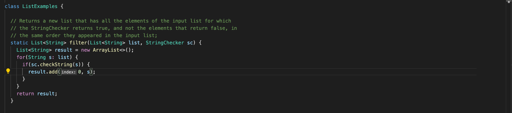

# Lab Report #2 
By Luis Trejo 

## Part 1: Simplest Search Engine 

- In this part during Lab #2, we worked with urls and in the lab and we worked with creating local hosts that produced int numbers for the website. 

- In this part we were supposed to use strings instead of Integers and to produce words in the local hosts.

> The code that I used in the assignment

.png)
.png)

1. This code is really similar to NumberServer which looks like this.

- The key difference to see here is that;
    
    1. Strings uses Vectors instead of int to make it function properly.
    2. Changes most of the function names into strings instead of ints.
    3. In general, different names not just same name code.

### Examples of Adding them in LocalHost 

> In this image it shows that your work is functioning properly as it shows the message pop up from the handleRequest that you wrote. To make this website run in the terminal you have to write something like this.

...
...
...
...
...

> In this start up code it creates the website called localhost:___ <--(numbers that you put in there) those numbers need to be near the 4000s to make it work, this number is called the **port**.

... 

### Next up would be **adding words** in the localhost 

...

>> In this localhost we just add in the url 
`add?s=_____/____ <--- ` in the underline you can add whatever you want in this case I added apple and pineapple and orange in here.

....

.....
### Another way to use words in the localhost, *Query*

...

>> In the local host what you can do is add in the url `search?s=___` in the underline you can add something that fits between words. (*E.g*: I used app because but apple and pineapple have it and not orange). So in the website it produced [apple,pineapple.]

...

..

.

## Part 2: Symptoms and Failure-inducing Inputs 

... 

### 1st Bug: **Array Methods**

1. The Failure-inducing Inputs

> This is the broken code.

...

> In this code the goal is to reverse the order in the **same** array, in another code it does the same but in a new array. Here are the @Tests that I created, (P.S I had testReversed as well, but that passed because it is a empty array.)

2. The Symptom

...

The test output:

> The tests produce a failure that saying that [0] isn't in the position of [3] in the array. Which is the bug.

3. The Bug in the code 

...

> Here is the improved code, the main issue is that it was missing a variable and subtracting 1 for the arr.length and calling the variable swap in general. The reason why is because the variable wasn't called/updated and caused no effect and caused the same array to be printed back.

....

### 2nd Bug : **List Method**

...

1. The Failure-inducing Inputs

...

> In this test code we are trying to get the specific words from input 2 and input 1 in the same new array so in this we are expecting : "Hello" "My" "name".

...

2. The test output

> The error here is that the test gives the reverse of the list and not the filtered version of the new array.

...

3. The Bug in the code

...

> To be honest, I didn't find the bug yet in time yet, but I have an idea of how to fix the bug in which the index [0] is adding everytime, so the list would be in the wrong order everytime. That is what I think the bug is.